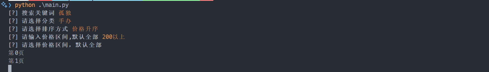

# 魔力赏市集搜索脚本

使用前请填写你自己的cookie，具体api分析见这篇[博客](https://qianxu.run/magic-market-search/)

```python
HEADERS = {
    "Cookie": "", #  TODO: 填写cookie
    "User-Agent": "Mozilla/5.0 (Windows NT 10.0; Win64; x64) AppleWebKit/537.36 (KHTML, like Gecko) Chrome/121.0.0.0 Safari/537.36",
}
```

# 安装
```shell
git clone git@github.com:qxdn/magic-market.git
cd magic-market
python -m pip install -r requestments.txt 
```

# 使用方法

```shell
python main.py
```
初次运行会生成`config.json`，里面填上你的cookie，再次运行
```json
{"cookie": "请填写cookie"}
```

结果会在`result.txt`里面

# 运行效果


# TODO
- [*] 更好的prompt方式
- [*] 多种检索方法
- [ ] 更好的412提示方式
